# ObservableCAFE

A Unix-philosophy reimplementation of the ObservableCAFE architecture as a suite
of small, composable programs. Services communicate through a central message
bus (`cafe-bus`) over a Unix socket.

## Projects

| Crate | Language | Role |
|---|---|---|
| `cafe-types` | Rust (lib) | Shared data model: Chunk, ContentType, annotations |
| `cafe-sdk` | Rust (lib) | Client library wrapping cafe-types (bus + HTTP) |
| `cafe-bus` | Rust | Central message bus (Unix socket, newline-delimited JSON) |
| `cafe-store` | Rust | SQLite persistence for sessions and chunks |
| `cafe-llm` | Rust | LLM backend bridge (OpenAI-compatible, Ollama) |
| `cafe-server` | Rust | HTTP REST API + SSE streaming + dynamic HTTP proxy |
| `cafe-tui` | Rust | Terminal UI (Ratatui) |
| `cafe-agent-runtime` | Rust | Agent pipeline orchestrator, cron scheduler, hot-reload |
| `cafe-tts` | Rust | Text-to-Speech synthesis (Voicebox) |
| `cafe-stt` | Rust | Speech-to-text transcription (Voicebox) |
| `cafe-comfy` | Rust | Image generation (ComfyUI) |
| `cafe-sheetbot` | Rust | SheetBot RPC bridge |
| `cafe-demo` | Rust | One-shot demo publisher |
| `cafe-dice` | Rust | Test tool-calling agent (dice roller) |
| `cafe-web-fetch` | Rust | Web content fetcher (bus agent, `!fetch <url>`) |
| `cafe-knowledgebase` | Rust | Vector search knowledge base (LanceDB, RAG) |
| `cafe-knowledgebase-index` | Rust | CLI for indexing documents into knowledgebase |
| `cafe-mcp-bridge` | Rust | MCP server — exposes bus tools via stdio/HTTP+SSE |
| `cafe-mcp-client` | Rust | MCP client — forwards tool calls to external MCP servers |
| `cafe-http-proxy-sdk` | Rust (lib) | SDK for dynamic HTTP route registration over bus |
| `cafe-binary-store` | Rust | Streaming binary asset storage (HTTP, JWT auth) |
| `cafe-cli` | Rust | Command-line bus client for debugging and e2e tests |
| `cafe-web-sdk` | TypeScript | ES module SDK for the cafe-server HTTP API |
| `cafe-web` | TypeScript | React frontend SPA |

## Prerequisites

- Rust (stable) — https://rustup.rs
- Go 1.22+ — https://go.dev/dl/
- Node.js 20+ — https://nodejs.org
- `process-compose` — https://github.com/F1bonacc1/process-compose

## Getting started

```sh
# Build all Rust binaries
cargo build --workspace

# Start all services (dev mode, uses launchd + process-compose)
./start.sh

# Run unit tests
cargo test

# Run end-to-end tests (requires release build)
cargo build --release
uv run tests/binary-store-e2e.py
```

## Architecture

All services communicate via `cafe-bus` over a Unix socket at
`/tmp/cafe-bus.sock`. Wire format is newline-delimited JSON using types
defined in `cafe-types`.

```mermaid
graph TD
    subgraph "Data Model"
        cafe-types
    end

    subgraph "Client SDKs"
        cafe-sdk --> cafe-types
        cafe-web-sdk
        cafe-http-proxy-sdk --> cafe-sdk
    end

    subgraph "Infrastructure"
        cafe-bus --> cafe-types
        cafe-store --> cafe-sdk
        cafe-server --> cafe-sdk
        cafe-binary-store --> cafe-sdk
    end

    subgraph "Agents & Pipeline"
        cafe-llm --> cafe-sdk
        cafe-tts --> cafe-sdk
        cafe-stt --> cafe-sdk
        cafe-comfy --> cafe-sdk
        cafe-sheetbot --> cafe-sdk
        cafe-dice --> cafe-sdk
        cafe-web-fetch --> cafe-sdk
        cafe-knowledgebase --> cafe-sdk
        cafe-agent-runtime --> cafe-sdk
        cafe-mcp-client --> cafe-sdk
    end

    subgraph "Frontend"
        cafe-tui --> cafe-sdk
        cafe-web --> cafe-web-sdk
    end

    subgraph "Tools"
        cafe-cli --> cafe-sdk
        cafe-demo --> cafe-sdk
        cafe-mcp-bridge --> cafe-sdk
        cafe-knowledgebase-index --> cafe-sdk
    end

    cafe-binary-store -.-> cafe-bus
    cafe-store -.-> cafe-bus
    cafe-llm -.-> cafe-bus
    cafe-tts -.-> cafe-bus
    cafe-stt -.-> cafe-bus
    cafe-comfy -.-> cafe-bus
    cafe-sheetbot -.-> cafe-bus
    cafe-dice -.-> cafe-bus
    cafe-web-fetch -.-> cafe-bus
    cafe-knowledgebase -.-> cafe-bus
    cafe-agent-runtime -.-> cafe-bus
    cafe-mcp-client -.-> cafe-bus
    cafe-server -.-> cafe-bus
    cafe-cli -.-> cafe-bus
    cafe-demo -.-> cafe-bus
    cafe-web-sdk -.-> cafe-server

    style cafe-bus fill:#4a6,color:#fff
    style cafe-types fill:#46a,color:#fff
    style cafe-sdk fill:#46a,color:#fff
    style cafe-web-sdk fill:#46a,color:#fff
```



## Documentation

- [`docs/architecture.md`](docs/architecture.md) — Full architecture design
- [`docs/cafe-annotations.md`](docs/cafe-annotations.md) — `cafe.*` annotation keys interpreted by bus and platform services
- [`docs/adr-*.md`](docs/) — Architecture Decision Records (109+ ADRs covering bus, chunks, sessions, binary streaming, MCP, etc.)
- [`docs/feature-matrix.md`](docs/feature-matrix.md) — Feature completeness tracking

## CLI

`cafe-cli` is a command-line interface to the bus. Run `cafe-cli --help` for
available commands.

```text
cafe-cli create-session --agent default
cafe-cli publish <session> --text "hello world"
cafe-cli list-models
cafe-cli history <session>
cafe-cli subscribe <session> --timeout-secs 5
```

## MCP Integration

`cafe-mcp-bridge` exposes all bus tools via the Model Context Protocol,
allowing AI assistants (opencode, Claude Desktop, Continue.dev) to call them.

**Stdio transport** (for opencode):
```json
{
  "mcpServers": {
    "cafe": {
      "command": "/path/to/cafe-mcp-bridge",
      "args": ["--meta"]
    }
  }
}
```

**HTTP transport** (persistent, port 3100):
```
# Connect with all tools
GET /sse

# Connect with only specific tools
GET /sse?tool=kb_search&tool=stt_transcribe

# Send a tool call
POST /message?sessionId=<from_sse>
{"jsonrpc":"2.0","id":1,"method":"tools/call","params":{"name":"kb_search","arguments":{...}}}
```

### MCP client (external tools)

`cafe-mcp-client` connects to external MCP servers (Tavily, filesystem, etc.)
and makes their tools available on the bus as `tool.call` chunks with
`provider: "mcp"`. Configured via `mcp-servers.toml`.

## E2E tests

Python (uv) based. Each test starts its own temporary bus for isolation.

```sh
cargo build --release

# Binary-store HTTP API (write/read/range/delete)
uv run tests/binary-store-e2e.py

# Binary-ref upload/download via bus
uv run tests/binary-ref-e2e.py

# SubscribeFiltered + session isolation
uv run tests/bus-filters-e2e.py

# Config switching (null chunks switch model/system prompt at runtime)
uv run tests/config-switching-e2e.py

# Full lifecycle: start → chat → shutdown → restart → persist → delete
uv run tests/lifecycle-e2e.py

# MCP bridge: tools/list, web_fetch (inline), meta tools, kb_search (RPC)
uv run tests/mcp-bridge-e2e.py

# MCP client: fake MCP server → tool.call (provider:mcp) → tool.result round-trip
uv run tests/mcp-client-e2e.py

# Speech-to-text: base64 audio → stt.invoke RPC → voicebox → result
uv run tests/stt-e2e.py

# Tool calling pipeline: user message → detector RPC → tool execution
uv run tests/tool-calling-e2e.py

# LLM-generated tool call lifecycle (dice-llm agent)
uv run tests/tool-lifecycle-e2e.py
```

## License

MIT
