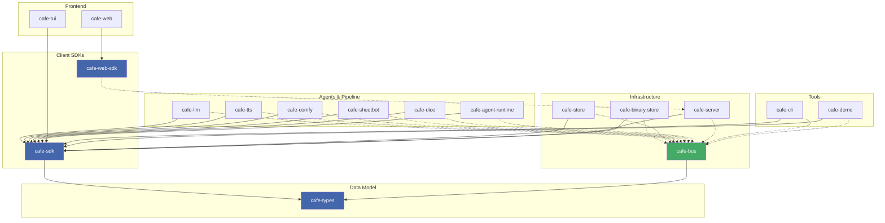

# ObservableCAFE

A Unix-philosophy reimplementation of the ObservableCAFE architecture as a suite of small, composable programs. Services communicate through a central message bus (`cafe-bus`) over a Unix socket.

## Projects

| Crate | Language | Role |
|---|---|---|
| `cafe-types` | Rust (lib) | Shared data model: Chunk, ContentType, annotations |
| `cafe-sdk` | Rust (lib) | Client library wrapping cafe-types (bus + HTTP) |
| `cafe-bus` | Rust | Central message bus (Unix socket, newline-delimited JSON) |
| `cafe-store` | Rust | SQLite persistence for sessions and chunks |
| `cafe-llm` | Rust | LLM backend bridge (OpenAI-compatible, Ollama) |
| `cafe-server` | Rust | HTTP REST API + SSE streaming |
| `cafe-tui` | Rust | Terminal UI (Ratatui) |
| `cafe-agent-runtime` | Rust | Agent pipeline orchestrator, cron scheduler, hot-reload |
| `cafe-tts` | Rust | Text-to-Speech synthesis (Voicebox) |
| `cafe-comfy` | Rust | Image generation (ComfyUI) |
| `cafe-sheetbot` | Rust | SheetBot RPC bridge |
| `cafe-demo` | Rust | One-shot demo publisher |
| `cafe-dice` | Rust | Test tool-calling agent (dice roller) |
| `cafe-telegram` | Go | Telegram bot bridge |
| `cafe-binary-store` | Rust | Streaming binary asset storage (HTTP, JWT auth) |
| `cafe-cli` | Rust | Command-line bus client for debugging and e2e tests |
| `cafe-web-sdk` | TypeScript | ES module SDK for the cafe-server HTTP API |
| `cafe-web` | TypeScript | React frontend SPA |

## Prerequisites

- Rust (stable) — https://rustup.rs
- Go 1.22+ — https://go.dev/dl/
- Node.js 20+ — https://nodejs.org
- `process-compose` — https://github.com/F1bonacc1/process-compose

## Getting started

```sh
# Build all Rust binaries
cargo build --workspace

# Start all services (dev mode, uses process-compose)
./start.sh

# Run unit tests
cargo test

# Run end-to-end tests (requires release build)
cargo build --release
uv run tests/binary-store-e2e.py
```

## Architecture



All services communicate via `cafe-bus` over a Unix socket at `/tmp/cafe-bus.sock`.
Wire format is newline-delimited JSON using types defined in `cafe-types`.

See [`docs/architecture.md`](docs/architecture.md) for the full design.

See [`docs/adr-*.md`](docs/) for Architecture Decision Records covering key design choices (SubscribeFiltered, Connection IDs, Direct-to, Mutations, Transient Retention, Binary Streaming, etc.).

## CLI

`cafe-cli` is a command-line interface to the bus. Run `cafe-cli --help` for available commands.

```text
cafe-cli create-session --agent default
cafe-cli publish <session> --text "hello world"
cafe-cli list-models
cafe-cli history <session>
cafe-cli subscribe <session> --timeout-secs 5
```

## E2E tests

Python (uv) based.

```sh
cargo build --release

# Binary-store HTTP API (write/read/range/delete)
uv run tests/binary-store-e2e.py

# Tool calling pipeline (user message → detector RPC → tool execution)
uv run tests/tool-calling-e2e.py

# Full lifecycle (start → chat → shutdown → restart → persist → delete)
uv run tests/lifecycle-e2e.py

# LLM-generated tool call lifecycle (dice-llm agent, tool call via LLM)
uv run tests/tool-lifecycle-e2e.py
```

## License

MIT
