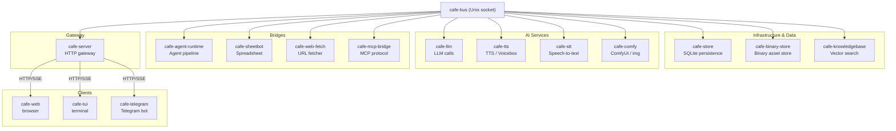
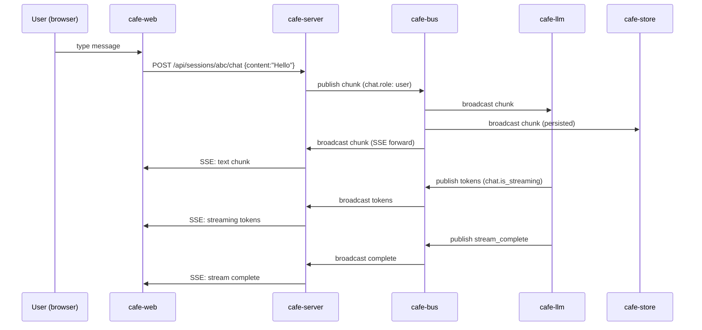
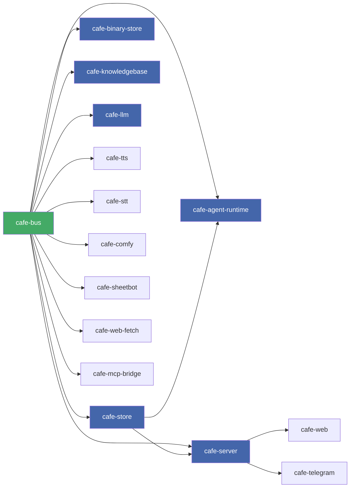

# Architecture

## System overview

ObservableCAFE is a suite of small, composable Unix processes that collectively implement
a reactive multi-agent LLM platform. Processes communicate via a central message bus
(`cafe-bus`) over a Unix domain socket. No process calls another directly.



---

## Data flow for a user message



---

## Startup order



Dependencies are enforced by `process-compose` via `depends_on` + readiness probes (see `process-compose.yml`).

---

## Key concepts

See `docs/spec-cafe.md` for the full data model specification.

**Chunk** — Immutable unit of data. Has an ID, content type (text/binary/binary-ref/null),
content, producer, annotations, and timestamp. `binary-ref` chunks announce binary
assets by reference — the actual bytes are stored in `cafe-binary-store` and streamed
via a separate HTTP endpoint.

**Annotation** — Key-value metadata on a chunk. Keys use dot-namespaced strings
(`chat.role`, `config.type`, `security.trust-level`). Full list in spec-cafe.md.

**Session** — Ordered history of chunks with input/output/error streams.
State is derived from history, not stored separately.

**Evaluator** — Function that takes a chunk + history and produces zero or more chunks.

**Agent** — Pipeline builder. Wires evaluators into a data flow for a session type.
In this implementation, agents are TOML files that declare a pipeline of named evaluators.

---

## IPC protocol

Full specification in `docs/spec-bus-protocol.md`.

Wire format: newline-delimited JSON (NDJSON) over Unix domain socket.

Client → bus:
```json
{ "op": "publish", "session_id": "abc", "chunk": { ...chunk fields... } }
{ "op": "subscribe", "session_id": "abc" }
{ "op": "subscribe_filtered", "session_id": "abc", "content_types": ["BinaryRef"] }
{ "op": "subscribe_all" }
{ "op": "create_session", "session_id": "abc", "agent_id": "default", "config": {} }
{ "op": "delete_session", "session_id": "abc" }
{ "op": "list_sessions" }
{ "op": "ping" }
```

Bus → client:
```json
{ "event": "chunk", "session_id": "abc", "chunk": { ...chunk fields... } }
{ "event": "history_complete", "session_id": "abc", "count": 42 }
```

---

## HTTP API

Full specification in `docs/spec-http-api.md`.

Base URL: `http://localhost:4000`  
Auth: `Authorization: Bearer <token>`

Key endpoints:
- `GET  /api/sessions` — list sessions
- `POST /api/sessions` — create session
- `POST /api/sessions/:id/chat` — send message, stream response (SSE)
- `GET  /api/sessions/:id/stream` — persistent SSE stream of all activity
- `GET  /health` — health check (no auth)

---

## Repository layout

See the [README](../README.md#projects) for the current list of projects with descriptions and languages.

---

## Design principles

1. **Chunks are immutable.** Produce new chunks with updated annotations; never mutate.
2. **The bus is the only shared state.** Services do not call each other directly.
3. **History is the source of truth.** Derive state by scanning chunk history.
4. **Errors are out-of-band.** Errors go to an error stream, never the data stream.
5. **All services must handle SIGTERM gracefully.** Flush work, close connections, exit 0.
6. **Log to stdout/stderr only.** Use `tracing` in Rust, `log/slog` in Go.
