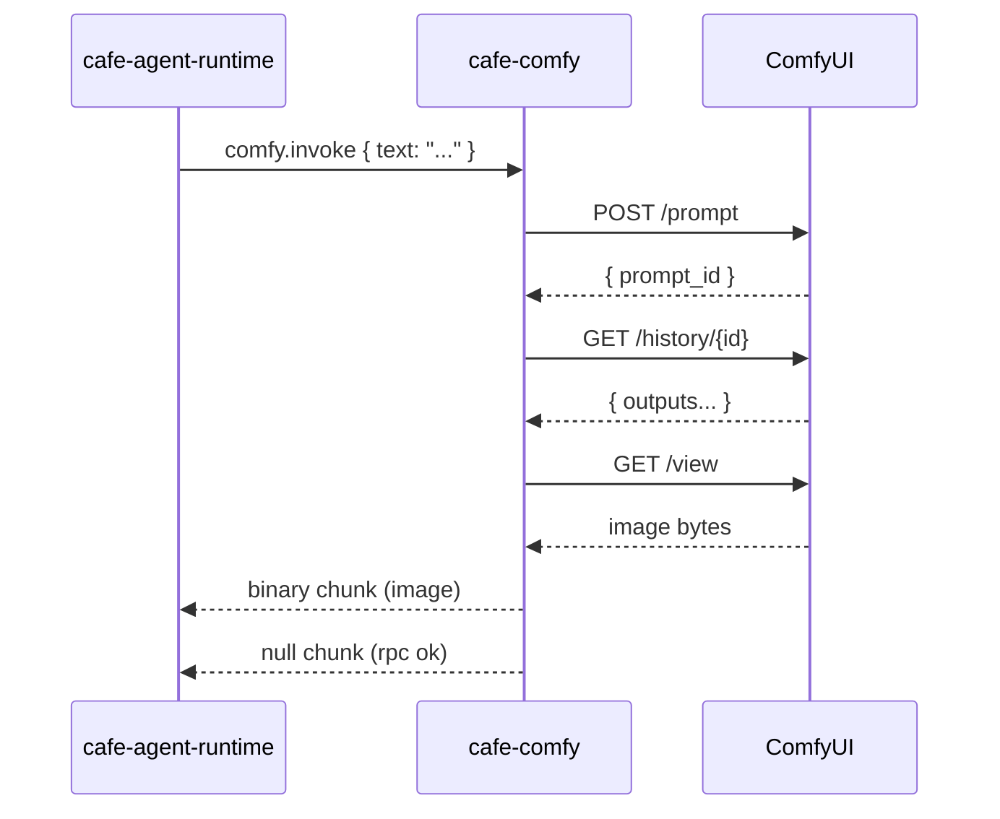

# cafe-comfy

ComfyUI image generation bridge. Subscribes to cafe-bus sessions, listens for
`comfy.invoke` JSON-RPC requests, runs a ComfyUI workflow with the prompt text
injected into the designated input node, and publishes the output image as a
binary chunk.

## Purpose

Takes the assembled LLM response text from an agent pipeline, injects it as the
positive prompt into a ComfyUI txt2img workflow, and publishes the resulting
image back to the session.

## Data flow



## Configuration

| Environment variable         | Default                    | Description                            |
|------------------------------|----------------------------|----------------------------------------|
| `CAFE_BUS_SOCKET`            | `/tmp/cafe-bus.sock`       | Bus Unix socket path                   |
| `COMFY_URL`                  | `http://127.0.0.1:8188`    | ComfyUI server base URL                |
| `COMFY_WORKFLOW_PATH`        | `./cafe-comfy/workflow.json` | Path to ComfyUI API-format workflow JSON |
| `COMFY_WORKFLOW_INPUT_NODE`  | `6`                        | Node ID whose `inputs.text` gets replaced |

## Workflow file

The workflow must be in **ComfyUI API format** (export via "Save (API Format)" in
ComfyUI). It is a flat JSON object keyed by node ID, where each node has
`class_type` and `inputs`. The `COMFY_WORKFLOW_INPUT_NODE` node must have an
`inputs.text` field — this is where the LLM prompt is injected.

Example minimal txt2img workflow:

```json
{
  "4": { "class_type": "CheckpointLoaderSimple", "inputs": { "ckpt_name": "model.safetensors" } },
  "6": { "class_type": "CLIPTextEncode", "inputs": { "text": "", "clip": ["4", 1] } },
  "8": { "class_type": "KSampler", "inputs": { ... } },
  "10": { "class_type": "SaveImage", "inputs": { "images": ["9", 0] } }
}
```

## Agent configuration

A `comfy` agent typically has pipeline `["trust-filter", "llm", "comfy"]`:

```toml
name = "comfy"
pipeline = ["trust-filter", "llm", "comfy"]

[initial_chunk]
type = "null"

[initial_chunk.annotations]
"config.type" = "runtime"
"config.llm.system_prompt" = "You are an image generation assistant. ..."
"config.comfy.workflow_path" = "workflow.json"
"config.comfy.workflow_input_node" = "6"
```

## RPC API

### `comfy.invoke`

**Params:**

| Field                  | Type   | Description                                 |
|------------------------|--------|---------------------------------------------|
| `text`                 | string | Prompt text (from assembled LLM response)   |
| `workflow_path`        | string | Override workflow file path                 |
| `workflow_input_node`  | string | Override input node ID                      |
| `endpoint`             | string | Override ComfyUI base URL                   |

**Result:**

```json
{ "chunk_id": "<uuid of published image chunk>" }
```

## Producer identifier

All chunks use `com.nominal.cafe-comfy`.
