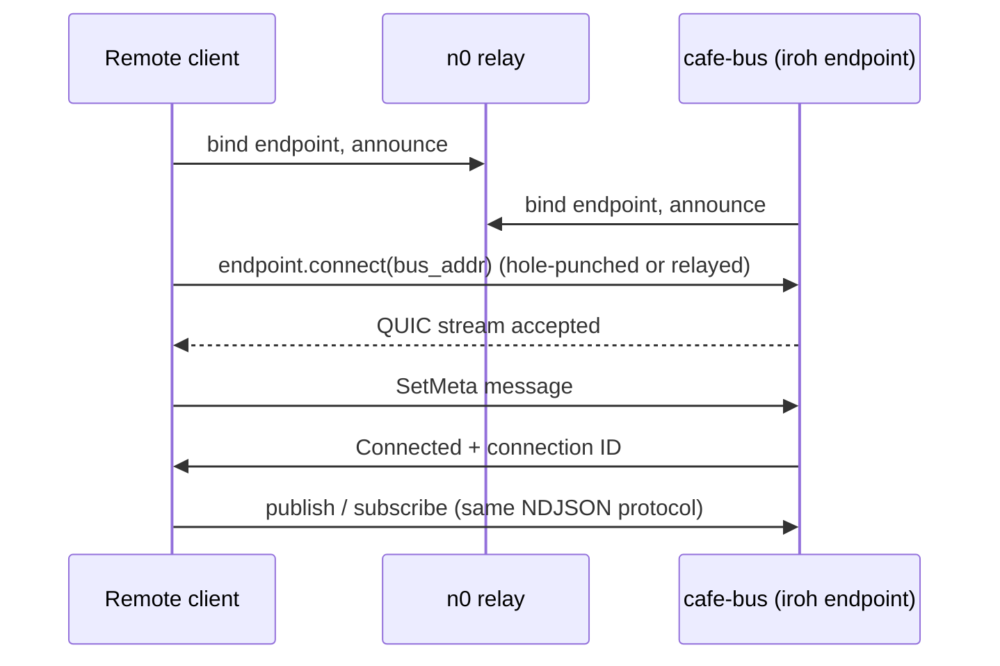

# How to: Connect over iroh

This guide shows you how to connect clients to a cafe-bus running on another
machine — through NATs and firewalls — using iroh's peer-to-peer QUIC transport.

The core idea: a cafe-bus can bind an iroh endpoint *alongside* its Unix socket.
Remote clients then connect to the bus's EndpointAddr (public key + relay URL)
instead of the socket. Once connected, the exact same NDJSON protocol runs over
the QUIC stream.

See [ADR-118](../adr-118-iroh-transport.md) and [ADR-120](../adr-120-iroh-allowlist.md)
for the design.

---

## 1. Enable iroh on the bus

Start the bus with a secret key (hex-encoded, 64 chars) to make it bind an iroh
endpoint:

```bash
export CAFE_BUS_IROH_SECRET_KEY=0123456789abcdef0123456789abcdef0123456789abcdef0123456789abcdef
cafe-bus
```

After startup the bus writes its EndpointAddr (public key, relay URL, IP
addresses) to `<socket-path>.iroh-addr` (e.g. `/tmp/cafe-bus.sock.iroh-addr`).

## 2. Connect with cafe-cli

Three equivalent ways:

**A. Auto-discovery via the addr file**

```sh
cafe-cli --bus /path/to/cafe-bus.sock create-session --agent default
```

The CLI reads the bus-written `.iroh-addr` file next to the socket.

**B. Explicit key + relay**

```sh
cafe-cli --bus-iroh-key <bus-public-key-hex> \
         --bus-iroh-relay https://euc1-1.relay.n0.iroh.link./ \
         create-session --agent default
```

**C. Environment variables**

```sh
export CAFE_BUS_IROH_KEY=<bus-public-key-hex>
export CAFE_BUS_IROH_RELAY=https://euc1-1.relay.n0.iroh.link./
export CAFE_BUS_IROH_ALPN=cafe-bus/0
cafe-cli create-session --agent default
```

## 3. Connect from a Rust service

Enable the feature and construct the client at startup, falling back to Unix:

```toml
cafe-sdk = { path = "../cafe-sdk", features = ["bus-client", "iroh-client"] }
```

```rust
use cafe_sdk::bus::{BusClient, IrohConfig};

// From CLI args / env
let cfg = IrohConfig::from_cli(
    cli_bus_iroh_key.as_deref(),
    cli_bus_iroh_relay.as_deref(),
    cli_bus_iroh_alpn.as_deref(),
)?;

// Or from the bus's addr file
let json = std::fs::read_to_string("/tmp/cafe-bus.sock.iroh-addr")?;
let cfg = IrohConfig::from_bus_addr_json(&json)?;

let client = if cfg.is_some() {
    BusClient::from_iroh_config(cfg).await?
} else {
    BusClient::unix(&socket_path)
};
// client.publish(), client.subscribe(), ... same API as Unix
```

## 4. Restrict who can connect (allowlist)

By default any endpoint with the bus's public key + relay URL can connect. To
restrict access, run the bus with an allowlist DB and manage it with the CLI:

```sh
# Print this client's stable peer ID (must match what you share with the bus)
cafe-cli iroh-allowlist my-id

# On the bus side, add allowed peers
cafe-cli iroh-allowlist add <peer-id> --label "home-machine"
cafe-cli iroh-allowlist list
cafe-cli iroh-allowlist remove <peer-id>
```

The allowlist DB path defaults to `$CAFE_BUS_IROH_ALLOWLIST_DB` (override with
`cafe-cli iroh-allowlist --db <path> ...`). See [ADR-120](../adr-120-iroh-allowlist.md).

## 5. How it works



## Relay servers

By default both sides use [n0's public relay network](https://n0.computer) — no
infrastructure needed. For production you can run your own relay and configure it
via `--bus-iroh-relay`.

## Limitations

- All clients share one bus endpoint; the bus does not federate between instances.
- Relay servers are an external dependency (n0 public relays by default).
- Everything is a single codec/protocol — ensure both sides agree on the same
  `BusCodec` (see [ADR-119](../adr-119-binary-codec.md)).

---

## Reference

- [ADR-118: iroh transport](../adr-118-iroh-transport.md) — full client setup and architecture
- [ADR-120: iroh allowlist](../adr-120-iroh-allowlist.md)
- [Bus protocol spec, iroh section](../spec-bus-protocol.md#iroh-transport)
