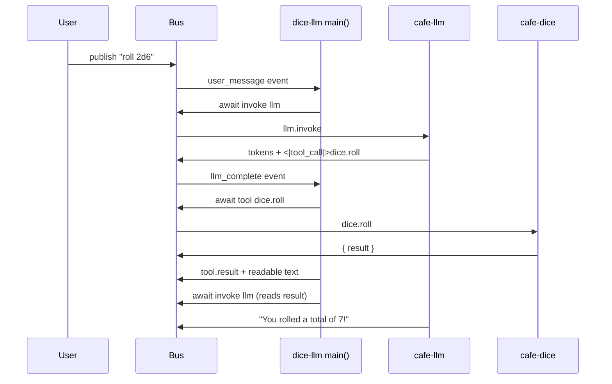

# Tutorial: A JS tool-calling agent

In the [JS starter tutorial](your-first-js-agent.md) your agent called an
evaluator directly. Now the **LLM decides to call a tool**: it generates a
tool-call marker, your JS parses it, awaits the tool RPC, and feeds the result
back so the LLM can answer. This is the JS port of [Tutorial
3](tool-calling-agent.md) — compare the four TOML steps there with one `main`
here.

By the end you'll understand the dice round-trip end to end, in promises.

---

## What you need

The stack from [Tutorial 1](getting-started.md), a working LLM backend, and
`cafe-dice` running (the dice-rolling tool backend) — same as Tutorial 3.

## Step 1 — Understand the flow

```js
async function main(cafe) {
  for await (const event of cafe.events()) {
    if (event.type === "user_message") {
      await cafe.invoke("llm", {});            // 1. LLM writes text (maybe a tool call)
    } else if (event.type === "llm_complete") {
      let called = false;
      for (const call of findToolCalls(event.text)) {
        called = true;
        await cafe.tool(call.name, call.parameters || {});  // 2. run the tool
      }                                          // 3. result auto-published as context
      if (called) {
        await cafe.invoke("llm", {});          // 4. LLM reads the result, answers
      }
    }
  }
  return "dice-llm: done";
}

function findToolCalls(text) {
  const calls = [];
  const re = /<\|tool_call\|>\s*(\{.*?\})\s*<\|tool_call_end\|>/g;
  let m;
  while ((m = re.exec(text)) !== null) {
    try { calls.push(JSON.parse(m[1])); } catch { /* skip malformed markers */ }
  }
  return calls;
}
```

No `tool-detector` / `tool-executor` steps, no `step_complete` wiring: the
generator order *is* the pipeline, and each RPC is one `await`. Errors reject
— wrap the body in `try/catch` to retry or fall back.

## Step 2 — The shipped agent

This flow ships as [`agents-js/dice-llm.js`](../../agents-js/dice-llm.js) —
the JS port of `agents/dice-llm.toml`. Its manifest advertises the tool to
the LLM exactly like the TOML `initial_chunk` did: a system prompt teaching
the `<|tool_call|>` marker format plus `tools.available` with the
`dice.roll` JSON Schema, both under `initial_config`. Its `main` is the loop
from Step 1 plus a `findToolCalls` regex helper. Read it now — the rest of
this tutorial walks through running it.

The key line is `await cafe.tool(call.name, call.parameters || {})`:
unlike raw `cafe.rpc`, `cafe.tool` publishes the bus-visible
`cafe.tool.result` chunk and the readable `Tool call completed…` text the
follow-up LLM turn reads from history — the equivalent of the old
`tool-executor` step, but awaitable.

## Step 3 — Run it

```sh
SESSION=$(cafe-cli create-session --agent dice-llm)
echo "$SESSION"

cafe-cli chat "$SESSION" "roll 2d6"
```

You should get "You rolled a total of 7!" — an actual `dice.roll` RPC
(`cafe.tool("dice.roll", { count, sides })`), not a guess. (It needs a real
LLM backend that emits the marker; the E2E suite drives this exact agent
against a scripted mock — see `tests/js-agents-e2e.py`.)

## Step 4 — Watch each stage

```sh
cafe-cli subscribe "$SESSION" --timeout-secs 15
```

In a second terminal, `cafe-cli publish "$SESSION" --text "give me a d20"`.
You'll see the same annotated chunks as Tutorial 3 — user chunk, streaming
tokens, the `<|tool_call|>` marker inside LLM text, your published
`Tool call completed` context chunk, the final answer — except the detector
and executor are ten lines of JS instead of two pipeline steps:



## Exercises

- **Parallel tools**: two markers in one reply → `await Promise.all(calls.map(...))`
  instead of the sequential loop.
- **Retry**: wrap `cafe.tool` in `try/catch` with one retry on rejection.
- **Stateful memory**: switch `mode` to `"stateful"` and keep a running total
  across rolls in a JS variable (see
  [`agents-js/counter.js`](../../agents-js/counter.js)).

## Next steps

- Full contract: [JS agent reference](../reference/js-agents.md).
- Raw RPC from the service side: [How to: add a service](../how-to/add-a-service.md).
- External MCP tools (`provider: "mcp"`): [Connect via MCP](../how-to/connect-mcp.md).
