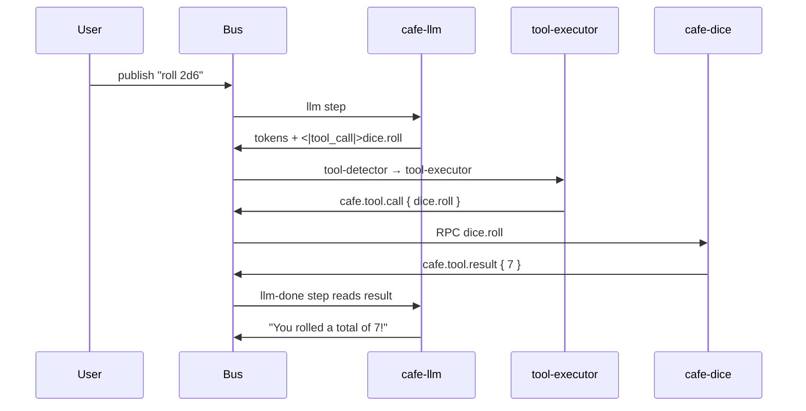

# Tutorial 3: A tool-calling agent

In [Tutorial 2](your-first-agent.md) you built an agent that transforms text
without an LLM. Now you'll build the full round-trip: the **LLM decides to call a
tool**, a service **executes it**, and the **result flows back to the LLM** so it
can answer the user.

By the end you'll understand the built-in `dice-llm` agent — the canonical
example of LLM-generated tool calling in this repo.

---

## What you need

The stack from [Tutorial 1](getting-started.md), plus a working LLM backend (the
same one you used for the `default` agent) and the `cafe-dice` service running
(the dice-rolling tool backend).

## Step 1 — Understand the pipeline

A tool-calling agent has four jobs, in order:

```toml
[[steps]]
id = "llm"             # 1. LLM generates text (maybe containing a tool call)
type = "llm"
trigger = "user_message"

[[steps]]
id = "tool-detector"   # 2. Detect a tool call in the LLM's output
type = "tool-detector"
trigger = "llm_complete"

[[steps]]
id = "tool-executor"   # 3. Execute the tool and publish the result
type = "tool-executor"
trigger = "step_complete:tool-detector"

[[steps]]
id = "llm-done"        # 4. LLM reads the result and answers the user
type = "llm"
trigger = "step_complete:tool-executor"
```

The wiring: `user_message` fires the first `llm`; when that completes,
`llm_complete` fires the detector; when the detector finishes,
`step_complete:tool-detector` fires the executor; and so on.

## Step 2 — Advertise the tool to the LLM

The LLM only calls tools it knows about. Tool definitions live in the agent's
`initial_chunk` under `tools.available`:

```toml
[initial_chunk]
type = "null"

[initial_chunk.annotations]
"config.type" = "runtime"
"config.llm.system_prompt" = "You are a helpful assistant with access to a dice-rolling tool..."
"tools.available" = [
  { name = "dice.roll", description = "Roll one or more dice and return the total",
    parameters = { type = "object",
      properties = { count = { type = "integer" }, sides = { type = "integer" } },
      required = ["count", "sides"] },
    tool_type = "rpc" },
]
```

The system prompt also teaches the LLM the exact calling convention:

```
To roll dice, you MUST invoke the dice.roll tool by emitting a tool call marker:

<|tool_call|>{"name":"dice.roll","parameters":{"count":2,"sides":6}}<|tool_call_end|>
```

## Step 3 — The whole file

This is the complete `agents/dice-llm.toml`:

```toml
name = "dice-llm"
description = "Dice rolling via LLM-generated tool calls — full round-trip with LLM feedback"
background = false
allows_reload = true
persists_state = false

[[steps]]
id = "llm"
type = "llm"
trigger = "user_message"

[[steps]]
id = "tool-detector"
type = "tool-detector"
trigger = "llm_complete"

[[steps]]
id = "tool-executor"
type = "tool-executor"
trigger = "step_complete:tool-detector"

[[steps]]
id = "llm-done"
type = "llm"
trigger = "step_complete:tool-executor"

[initial_chunk]
type = "null"

[initial_chunk.annotations]
"config.type" = "runtime"
"config.llm.system_prompt" = """
You are a helpful assistant with access to a dice-rolling tool.
...
"""
"tools.available" = [
  { name = "dice.roll", description = "Roll one or more dice and return the total",
    parameters = { type = "object",
      properties = { count = { type = "integer", description = "Number of dice" },
                     sides = { type = "integer", description = "Number of sides per die" } },
      required = ["count", "sides"] },
    tool_type = "rpc" },
]
```

## Step 4 — Run it

```sh
SESSION=$(cafe-cli create-session --agent dice-llm)
echo "$SESSION"

cafe-cli chat "$SESSION" "roll 2d6"
```

You should get an answer like "You rolled a total of 7!" — the result of an
actual `dice.roll` RPC, not a guess.

## Step 5 — Watch each stage

Subscribe to the session and send another message to see the annotated chunks:

```sh
cafe-cli subscribe "$SESSION" --timeout-secs 15
```

In a second terminal:

```sh
cafe-cli publish "$SESSION" --text "give me a d20"
```

You'll see, in order:

1. Your user chunk (`chat.role: user`)
2. Streaming LLM tokens (`chat.is_streaming`)
3. The stream-complete marker
4. A chunk annotated `cafe.tool.call` with `{"name":"dice.roll",...}` (from the detector)
5. A chunk annotated `cafe.tool.result` with the rolled total (from the executor)
6. The final LLM answer, which read that result

## What just happened?

The bus carried every stage as **immutable annotated chunks**:



The detector parses `<|tool_call|>` markers into a structured
`cafe.tool.call` annotation; the executor turns that into a JSON-RPC call on the
bus; the result comes back as a `cafe.tool.result` annotation; and the final
`llm` step has the result in its history to answer the user.

## Beyond RPC tools: external MCP tools

The same agent shape works for tools served by *external* MCP servers (Tavily,
filesystem, etc.), via `cafe-mcp-client`. The difference: the tool definition
carries `provider = "mcp"`, and the `tool-executor` skips those calls so
`cafe-mcp-client` can handle them instead. See
[Connect via MCP](../how-to/connect-mcp.md) and
[ADR-112](../adr-112-mcp-bridge.md).

## Next steps

- Tool annotation details: [`cafe.tool.*` keys](../spec-cafe.md#tool-use).
- The execution internals: [ADR-112](../adr-112-mcp-bridge.md).
- How config flows to the LLM: [SessionConfig](../../cafe-agent-runtime/src/config.rs).
